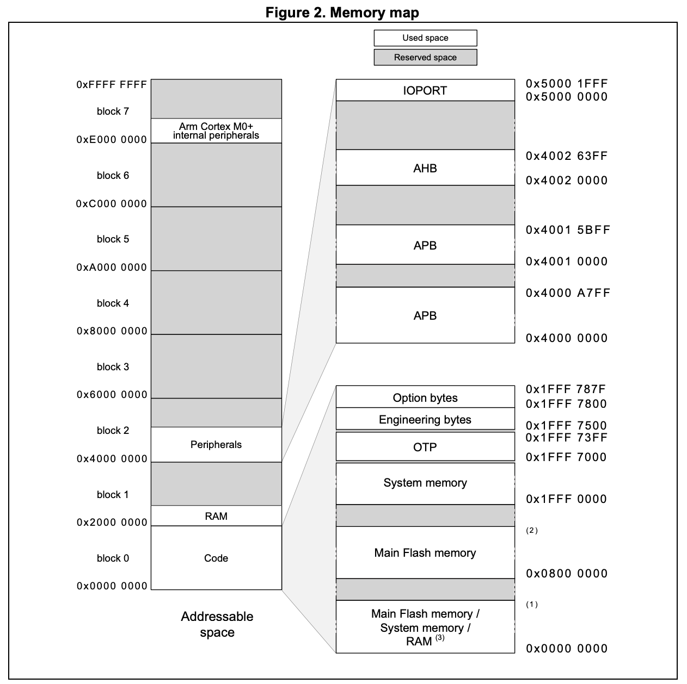
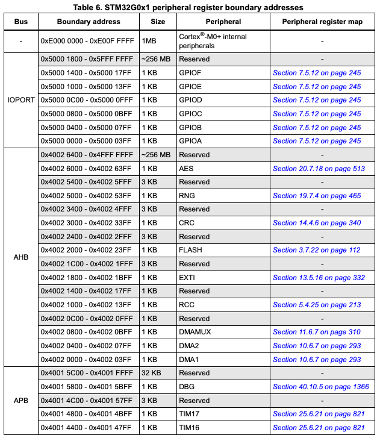

# Blink Demo

This is just a simple blink LED demo for the [Nucleo-G031K8](https://www.digikey.com/en/products/detail/stmicroelectronics/NUCLEO-G031K8/10321671) development board to demonstrate the basics of startup code and a linkerscript from scratch.

## MCU Start Up Process

**What happens before `main`?**

Well, it depends on the particular MCU, but in general something like the following:

1. MCU hardware boots up: power supply(ies) finish ramping up, internal PLL(s) lock / minimum clock configuration is initialized, etc...

2. Some MCUs (including our STM32G0xx parts) have internal ROM bootloaders that they will jump to depending on external pin strapping (like the BOOT0 & BOOT1 pins on STM32 MCUs). For example, if the BOOT0 pin is high, the MCU will set the PC register to an internal ROM address corresponding to a bootloader and start executing from there.

3. But assuming a normal boot sequence to our firmware, the MCU will start executing from a specific, fixed address in flash memory. The MCU hardware will set the PC register to this fixed address upon reset. *This is where "startup" code is run*.

4. Next, the SP (stack pointer) register needs to point to the start of the stack, which is typically the end of the RAM region - the stack grows down. Some MCUs do this in HW automatically (just like they do for the PC register), but others require doing this manually with a load register instruction. Once the stack pointer is set, we can start calling functions :).

5. Then the C (& C++ if we use it) runtime environment needs to get initialized. There are a few steps to this:

    a. Copy global and static variables to RAM so they can be modified during runtime.

    b. Initialize uninitialized variables to zero. Upon reset, RAM may not be initialized to 0, so we cannot assume our uninitialized variables are default initialized to 0 or null like we expect unless we do this manually in our startup code.

    > **c. Only for C++ programs, or C programs with functions marked with `__attribute__((constructor))`**: Call `__libc_init_array`. This function calls static/global variable constructors and otherwise initializes more complex static/global variables that can't simply be initialized with assignment. How this works: linker magic...
    > * The linker collects a list of function pointers to constructors/initialization functions that need to be called. This list gets stored in a special memory section typically defined in the linkerscript as `.init_array`.
    > * The startup code loops through the function pointers in the `.init_array` section and calls each one.

6. Finally, we can call `main`!

7. For MCU embedded systems, we typically expect that the `main` function finishes initializing HW peripherals and then enters an infinite while loop, thus never returning. But just in case `main` returns for some reason, it is usually a good idea to include an infinite while loop or call some kind of hard fault handler after `main` is called.

## Vector Table

ARM MCUs, like the STM32G0xx series, have what's called a "Vector Table" at fixed memory address (typically the start of flash memory). The Vector Table is essentially a look-up table of addresses in memory, mostly for event/interrupt handler functions. The first entry in the vector table is the address that the stack pointer should be initialized to, and the second entry is the address of the reset handler. This is the code that the MCU starts executing immediately after power-on or reset. It typically initializes the system and sets up the MCU for operation by doing the things listed above. Basically, the second entry in the vector table should point to the startup code. The first 16 entries are reserved by ARM and are common for all ARM MCUs; the remainder of the vector table entries are for interrupt/event handlers that are specific to a particular MCU.

## References

The official "template" startup code from ST/ARM for gcc tools, [startup_stm32g031xx.s](https://github.com/STMicroelectronics/cmsis-device-g0/blob/master/Source/Templates/gcc/startup_stm32g031xx.s) contains everything discussed above. See that as a more official/polished example. You can also find an example linkerscript from ST [here](https://github.com/STMicroelectronics/STM32CubeG0/blob/master/Projects/NUCLEO-G031K8/Templates/STM32CubeIDE/STM32G031K8TX_FLASH.ld). Note that the [startup code](https://github.com/STMicroelectronics/STM32CubeG0/blob/master/Projects/NUCLEO-G031K8/Templates/STM32CubeIDE/Application/Startup/startup_stm32g031k8tx.s) is also the same in this ST repository.

## Blink From Scratch

Ok, now that we've summarized what we need to do in startup code before `main` behind the scenes, let's write a basic LED blink demo for the [Nucleo-G031K8](https://www.digikey.com/en/products/detail/stmicroelectronics/NUCLEO-G031K8/10321671) in a single .c file from scratch. We'll also need a linkerscript .ld file, and a Makefile for easy and repeatable builds.

### Install Toolchain

First, follow the prerequisites section in this repository's top level [README.md](../../README.md). You can skip the part about installing `bazelisk` / `bazel`. We'll just use a Makefile for this tutorial.

### Makefile

Before writing any code, let's start with a super basic `Makefile`. Specify the GCC toolchain prefix, then compiler first. Many projects will require using the linker `ld` separately from the `gcc` compiler, but for our simple blink demo we can compile and "link" our single source file with just the `gcc` compiler. Many projects will also use an assembler `as` for assembly source files (common for startup code, for example), but we will not need an assembler for our basic blink example, which is just a single C file. However, we do need `objcopy` to convert the output .elf file into a simple .bin file that can be programmed into our MCU's flash memory.

```
PREFIX = arm-none-eabi
CC = $(PREFIX)-gcc
OBJCOPY = $(PREFIX)-objcopy
```

At a minimum, the compiler needs to know the target cpu architecture. We specify this with `-mcpu=cortex-m0plus`. We also tell the compiler it can use ARM's smaller 16bit "Thumb" instructions were possible with `-mthumb` - this is common practice for resource constrained embedded systems, using thumb instructions reduces code size. Next, tell the compiler to include debugging information and *not* do any optimizations with `-g` and `-O0` respectively - this will make it easier to see what is going on under the hood after the program is compiled. Finally, enable compiler warnings with `-Wall` and `-Wextra`.

```
CFLAGS = -mcpu=cortex-m0plus -mthumb
CFLAGS += -g -O0
CFLAGS += -Wall -Wextra
```

If we were using an assembler, we'd also likely want to define a list of assembler flags. The same goes for compiling C++ source files as well. Some flags, like those specifying our target architecture for cross-compilation, for example, might be common between assembly, C, and C++ source file compilation. It's fairly common to store these in a separate Makefile variable like `ARCH_FLAGS` or something like that. But we're keeping things simple for this example.

The linker flags are a bit more interesting. First, we want to tell the linker *not* to include the standard startup code provided by the toolchain using the `-nostartfiles` flag. We want to write our own (plus, the standard startup code usually won't fit your MCU as some details vary from one MCU to another).

We also tell the linker not to link against any of the standard C libraries with the `-nostdlib` flag. This is an even broader directive than `-nolibc` which is also commonly used. `-nostdlib` also excludes libraries like  `libgcc` (the GCC support library) or `libm` (the math library). We exclude these standard libraries because they are often unneeded, or larger than we can really afford for our resource constrained microcontroller-based embedded system. Instead, we allow the linker to link against a smaller and more efficient set of libraries with the `--specs=nano.specs` flag. Specifically, this tells the linker it can use the [newlib](https://en.wikipedia.org/wiki/Newlib) library. We also tell the linker to replace the standard C library functions that rely on OS syscalls with stubs using the `--specs=nosys.specs` flag. This declares a set of function stubs ("syscalls" like `_close` or `_sbrk`) that we can define if we need to emulate the behavior of a system call (like `printf`). We also add `-lc` and `-lgcc` flags to allow linking against just the bare minimum set of C standard functions like `strcmp`. While `-nostdlib` and `-lc`/`-lgcc` might seem contradictory, they can be used together to achieve fine-grained control over what parts of the standard library are available to the linker.

Altogether, the `-nostdlib`, `--specs=nano.specs`, `--specs=nosys.specs`, `-lc`, and `-lgcc` linker directives ensure we have a minimal C runtime environment for our STM32G0xx projects, but allow us to use functions like `strcmp` or override `printf` if we want to.

Finally, we add `-Wl,--gc-section` to the linker flags to tell the linker to remove any unused code or data after everything is linked together (sort of like garbage collection at the end of linking).

```
LDFLAGS = -nostartfiles
LDFLAGS += -nostdlib --specs=nano.specs --specs=nosys.specs -lc -lgcc
LDFLAGS += -Wl,--gc-section
```

Next, list the linkerscript, source file, and define the intermediate and final output .elf and .bin files:

```
LDSCRIPT = link.ld
SOURCES = blink.c
ELF = blink.elf
BIN = blink.bin
```

And now the `Makefile` rules:

```
$(ELF): $(SOURCES)
	$(CC) $(CFLAGS) $(LDFLAGS) -T ${LDSCRIPT} $(SOURCES) -o $@

$(BIN): $(ELF)
	$(OBJCOPY) -O binary $< $@

clean:
	rm -rf $(ELF) $(BIN)

flash: $(BIN)
	st-flash --reset write $< 0x08000000

all: $(ELF)

.PHONY: all clean flash
```

The above rules allow us to: (1) build and "link" our single `blink.c` file into `blink.elf`; (2) objcopy that `blink.elf` into `blink.bin` that can be directly placed in our MCU's flash memory; (3) clean our build (i.e. remove intermediate and final output files for a "clean" slate to start our next build from scratch); and (4) take `blink.bin` and place it in our STM32G031's flash memory at address `0x08000000`. From the STM32G0xx memory map defined in the [reference manual](https://www.st.com/resource/en/reference_manual/rm0444-stm32g0x1-advanced-armbased-32bit-mcus-stmicroelectronics.pdf), we can see that `0x08000000` is the starting location for our firmware programs in flash memory (this is common for every STM32 MCU that I know of, but may not be true for other MCU families - check your part's documentation). More on this to follow in the next section on linkerscripts.

The `all` and `.PHONY` targets are special `Makefile` rules. `all` is the default target that will be built if you just run `make`. `.PHONY` is used to specify which build rule targets are *not* the name of a file. So, for example, the `$(BIN)` rule is not phony, but `clean`, `flash`, and `all` are.

Great! Let's get the linkerscript in order next...

### Linkerscript

Keep the STM32G031xx [datasheet](https://www.st.com/resource/en/datasheet/stm32g031c6.pdf) and [reference manual](https://www.st.com/resource/en/reference_manual/rm0444-stm32g0x1-advanced-armbased-32bit-mcus-stmicroelectronics.pdf) handy for this section. Feel free to reference [this template linkerscript](https://github.com/STMicroelectronics/STM32CubeG0/blob/master/Projects/NUCLEO-G031K8/Templates/STM32CubeIDE/STM32G031K8TX_FLASH.ld) from ST as well.

The linkerscript tells the linker how to arrange everything in memory in the final binary. Therefore, the linkerscript must first describe the flash and RAM memory partitions of the target MCU. From pg. 61 of the [reference manual](https://www.st.com/resource/en/reference_manual/rm0444-stm32g0x1-advanced-armbased-32bit-mcus-stmicroelectronics.pdf):



Flash memory starts at 0x08000000 and is 64KB long. RAM starts at 0x20000000 and is 8KB long. Specify this in `link.ld` with the following:

```
MEMORY {
    FLASH (RX) : ORIGIN = 0x08000000, LENGTH = 64K
    RAM (RWX) : ORIGIN = 0x20000000, LENGTH = 8K
}
```

Next, specify the entry point function for the firmware. This is ultimately where our startup code is implemented. We'll get to this in a moment. Call it `ResetHandler` or something similar.

It's also convenient to calculate and store the desired initial stack pointer value in the linkerscript so that our startup code can use it without needing to know the final RAM address. Again, this will be more clear when we get to the startup code.

```
ENTRY(ResetHandler)
initial_stack_ptr = ORIGIN(RAM) + LENGTH(RAM);
```

Now the linkerscript just needs to outline how each section should be placed in memory. These are the minimum set of sections that need to be placed:
* `.vector_table`:
    * This is the Vector Table describer earlier. It's basically a look up take for interrupt/event handlers, starting with the ResetHandler (our startup code). It also stores the initial stack, which is actually placed first in the LUT (then the ResetHandler and all other handler function pointers follow). The Vector Table must be placed right at the start of flash memory (you can technically move the vector table, but you must remap each entry accordingly - it's good practice to avoid doing this unless absolutely necessary). We explicitly tell the linker not to rearrange or move the vector table with the `KEEP` macro. Also, we can name this section whatever we'd like, so long as it matches our startup code; I chose "vector_table", but the standard CMSIS template from ST uses "isr_vectors".
* `.text`:
    * This section contains our program code. We place this section in flash memory.
* `.rodata`:
    * This section contains read only data like constants or string literals. It gets placed in flash memory as well, typically right after the `.text` section (and some linker scripts place it within the `.text` section).
* `.data`:
    * This section contains our initialized variables that need to be copied into RAM by our startup code.

> * `.init_array` and similar: In C programs with functions marked as `__attribute__((constructor))`, or C++ programs with classes, there might be sections called `.preinit_array`, `.init_array`, and `.fini_array`. These sections are used to provide a well-defined order of initialization of global/static variables that might need to have constructors called during startup. This is handled in our startup code by calling `__libc_init_array` as discussed earlier. To keep things simple, we will not include these sections in the linkerscript and therefore will avoid using constructors.

* `.bss`:
    * This section contains our *un*initialized (and zero initialized) variables that need to be placed into RAM and *zero initialized* by our startup code.

These are just the bare-minimum set of sections. More complicated systems might have separate sections for an A/B firmware bootloader, with firmware partiion A and firmware partition B, for example.

Here's what the sections look like in our `link.ld`:

```
SECTIONS {
    .vector_table : {
        . = ALIGN(4);
        KEEP(*(.vector_table))
        . = ALIGN(4);
    } > FLASH

    .text : {
        . = ALIGN(4);
        *(.text*)
        . = ALIGN(4);
    } > FLASH

    .rodata : {
        . = ALIGN(4);
        *(.rodata*)
        . = ALIGN(4);
    } > FLASH

    /* We aren't supporting C/C++ constructors or anything that would require .init_data */
    /* (and similar) sections, but if we were, they would go here */

    flash_data_start = LOADADDR(.data);
    .data : {
        . = ALIGN(4);
        ram_data_start = .;
        *(.data*)
        . = ALIGN(4);
        ram_data_end = .;
    }

    .bss : {
        . = ALIGN(4);
        bss_start = .;
        *(.bss*)
        . = ALIGN(4);
        bss_end = .;
    } > RAM
}
```

A few notes:
* We use `ALIGN(4)` at the beginning and end of each section to ensure each section is aligned to a word boundary. It isn't strictly necessary to specify this alignment, since the vector table, for example, is already placed at a word aligned address, but it's good practice to specify alignment explicitly.
* We define symbols that our startup code can use to copy initialized data to RAM, and zero initialize the bss section in RAM as well. We need: `flash_data_start`, `ram_data_start`, `ram_data_end`, `bss_start`, and `bss_end`.

### blink.c

#### Startup + Skeleton Code First 

Finally, on to some code!

We'll write everything, including the startup code, in `blink.c`. One quick note: startup code is often written in assembly. We need to be careful implementing startup code in C, because the C runtime environment won't be completely set up yet (that's what our startup code does!).

For starters, every good C program needs a `main` function. For now we'll leave it blank.

```
int main() {
    return 0;
}
```

Next, we need to define the `ResetHandler` function referenced by our linkerscript. This is where our startup code will go. Here's a quick summary of the startup routine, which we described earlier:

1. If we did need to store the initial stack pointer in the sp register, do that first with a few assembly instructions.

2. ST's example startup code calls `SystemInit`, which users can override with their own code for things like clock configuration. However, I can't think of a reason this needs to happen here rather than at the start of `main`, where the rest of the C runtime environment will be configured. I prefer to do clock (and other peripheral) initialization there, so skip this step in our code as well.

3. We then copy the `.data` section from flash to RAM, and set the `.bss` section in RAM to 0. It would be nice to use things like `memcopy` and `memset`, but that might actually be a bad idea for two reasons (described below). So instead we use basic loops to do this by hand ourselves.

    * We might want to use this startup code in a project that does *not* need or even link in the C standard libraries containing `memcopy` and `memset`.

    * Even if our project includes `memcopy` and `memset`, we don't want to make any assumptions about their implementations. Remember, we are copying initialized global/static variables and constants from flash to RAM so that they can be used. Similarly we are making sure that uninitialized variables are set to 0 as we typically expect in a C program. If the `memcopy` or `memset` implementations rely on global/static initialized variables, constants, or default initialized to 0 variables, then we cannot trust their implementations in our startup code.

4. If we needed to use call constructors or otherwise initialize more complex variables that cannot be initialized just with assignment prior to calling main, then we would call `__libc_init_array()` next, or implement similar functionality ourselves. Basically, we'd add the `.init_array` section to our linkerscript, and then the linker would populate this section with a bunch of function pointers to the constructors that we'd need to call at this stage in our startup code. We'd loop through that list of function pointers here, and call each one. The `__libc_init_array()` function is usually provided by whatever C library we are using (like newlib), so it is uncommon to have to write it yourself.

5. Finally we can call `main`!

6. In case `main` returns unexpectedly, add an infinite while loop at the end of our `ResetHandler`. Alternatively we could jump to some sort of hard fault handler or something similar here if we had something like that.

```
void ResetHandler() {
    // Set stack pointer register if needed.

    // Defined in the linkerscript.
    extern unsigned int flash_data_start, ram_data_start, ram_data_end, bss_start, bss_end;

    unsigned int *flash_data_src = &flash_data_start;
    unsigned int *ram_data_dst = &ram_data_start;
    while (ram_data_dst < &ram_data_end) {
        *ram_data_dst++ = *flash_data_src++;
    }

    for (unsigned int *bss_idx = &bss_start; bss_idx < &bss_end; bss_idx++) {
        *bss_idx = 0;
    }

    // Call __libc_init_array() or implement ourselves if needed.

    main();

    while(1);
}
```

Now the last thing we need to do is define the vector table. The vector table for the STM32G031K8 MCU on our Nucleo board is defined in Table 61 on pg. 312 of the [reference manual](https://www.st.com/resource/en/reference_manual/rm0444-stm32g0x1-advanced-armbased-32bit-mcus-stmicroelectronics.pdf). There are 16 Cortex-M0+ entries reserved by ARM first (as we discussed above), followed by 32 STM32G0xx-specific entries. We can define a mostly empty vector table as an array of constant function pointers like so:

```
extern void initial_stack_ptr();

__attribute__((section(".vector_table")))
void (*const vector_table[16 + 32])() = {
    initial_stack_ptr,
    ResetHandler,
    // Other event/interrupt handler function pointers would go here.
};
```

We use `__attribute__((section(".vector_table)))` to make sure this gets placed in the `.vector_table` section. In our minimal vector table, we've just placed the `initial_stack_ptr` defined in our linkerscript, and the `ResetHandler` defined above.

Here's what our `blink.c` should look like now:

```
int main() {
    return 0;
}

void ResetHandler() {
    // Set stack pointer register if needed.

    // Defined in the linkerscript.
    extern unsigned int flash_data_start, ram_data_start, ram_data_end, bss_start, bss_end;

    unsigned int *flash_data_src = &flash_data_start;
    unsigned int *ram_data_dst = &ram_data_start;
    while (ram_data_dst < &ram_data_end) {
        *ram_data_dst++ = *flash_data_src++;
    }

    for (unsigned int *bss_idx = &bss_start; bss_idx < &bss_end; bss_idx++) {
        *bss_idx = 0;
    }

    // Call __libc_init_array() or implement ourselves if needed.

    main();

    while(1);
}

extern void initial_stack_ptr();

__attribute__((section(".vector_table")))
void (*const vector_table[16 + 32])() = {
    initial_stack_ptr,
    ResetHandler,
    // Other event/interrupt handler function pointers would go here.
};
```

We are almost done! Now all we need to do is update `main` to blink the user LED on/off.

#### Make the LED Blink!

The user LED is on GPIO pin PC6 on the STM32G0xx nucleo board according to the [user manual](https://www.st.com/resource/en/user_manual/dm00622380-stm32g0-nucleo-32-board-mb1455-stmicroelectronics.pdf). PC6 means GPIO port C, pin 6. The *bare miniumum* things we need to do to drive the LED on/off are:

1. Enable the GPIOC peripheral clock.

2. Configure GPIOC pin 6 to be an output push-pull.

From section 5.4.13 on page 192 in the [reference manual](https://www.st.com/resource/en/reference_manual/rm0444-stm32g0x1-advanced-armbased-32bit-mcus-stmicroelectronics.pdf), we can enable the GPIOC clock by writing a 1 to the 2nd bit (0 indexed) in the `RCC_IOPENR` register. And to configure pin 6 of GPIOC as an output push-pull, we need to write `0b01` to bits 12 & 13 in the `GPIOC_MODER` register (section 7.5.1, page 238 in the [refernce manual](https://www.st.com/resource/en/reference_manual/rm0444-stm32g0x1-advanced-armbased-32bit-mcus-stmicroelectronics.pdf)).

Setting the LED is also easy. We write a 1 to the 6th bit in the `GPIOC_ODR` register to turn the LED on, and write a 0 to the same bit to turn it off.

All of these peripheral registers are in the **0x4000000** - **0x50001FFF** memory region, as defined in the memory map from Figure 2 on page 61 of the [reference manual](https://www.st.com/resource/en/reference_manual/rm0444-stm32g0x1-advanced-armbased-32bit-mcus-stmicroelectronics.pdf). See the memory map again below:


The tables following the memory map in the reference manual further outline where all of the peripheral registers live. See the below screenshot of Table 6 on page 64 of the [reference manual](https://www.st.com/resource/en/reference_manual/rm0444-stm32g0x1-advanced-armbased-32bit-mcus-stmicroelectronics.pdf).



We can see that the RCC registers are in the **0x40021000** - **0x400213FF** region, and the GPIOC registers are in the 0x50000800 - 0x50000BFF region. Following the links in the right column of Table 6 for the RCC and GPIOC peripherals, we see Table 37 and Table 46 respectively. These tables list the offset for each register for these peripherals. This "offset" just needs to be added to the base address for both peripherals to get the final register addresses.

Let's define these register addresses at the top of `blink.c`:

```
#define RCC_IOPENR 0x40021034
#define GPIOC_MODER 0x50000800
#define GPIOC_ODR 0x50000814
```

We'll also need to define a simple delay function to use between turning the LED on/off so that we can actually see it blink (humans can't really tell if a light is flickering beyond ~30Hz). We write for loop that does nothing for a large number of iterations:

```
void delay(volatile uint32_t iterations) {
    while (iterations != 0) {
        iterations--;
    }
}
```

Now we can put it all together! First, configure PC6 as an output at the start of our `main` function by writing to the `RCC_IOPENR` followed by the `GPIOC_MODER` register. Then we can enter an infinite while loop and toggle the LED on/off by writing to the `GPIOC_ODR` register, calling our `delay` function in between. For convenience (and to test that we can indeed use global/static variables and constants), I defined a default number of delay iterations in the `kDelayIterations` variable. Putting it all together, here is our `blink.c` file(!):

```
#define RCC_IOPENR 0x40021034
#define GPIOC_MODER 0x50000800
#define GPIOC_ODR 0x50000814

static const unsigned int kDelayIterations = 1000000;

void delay(volatile unsigned int iterations) {
    while (iterations != 0) {
        iterations--;
    }
}

int main() {
    *(unsigned int *)(RCC_IOPENR) |= (1 << 2);
    *(unsigned int *)(GPIOC_MODER) = (*(unsigned int *)(GPIOC_MODER) & ~(0b11 << 12)) |
                                     (0b01 << 12);

    while(1) {
        *(unsigned int *)(GPIOC_ODR) |= (1 << 6);
        delay(kDelayIterations);
        *(unsigned int *)(GPIOC_ODR) &= ~(1 << 6);
        delay(kDelayIterations);
    }

    return 0;
}

void ResetHandler() {
    extern unsigned int flash_data_start, ram_data_start, ram_data_end, bss_start, bss_end;

    unsigned int *flash_data_src = &flash_data_start;
    unsigned int *ram_data_dst = &ram_data_start;
    while (ram_data_dst < &ram_data_end) {
        *ram_data_dst++ = *flash_data_src++;
    }

    for (unsigned int *bss_idx = &bss_start; bss_idx < &bss_end; bss_idx++) {
        *bss_idx = 0;
    }

    main();

    while(1);
}

extern void initial_stack_ptr();

__attribute__((section(".vector_table")))
void (*const vector_table[16 + 32])() = {
    initial_stack_ptr,
    ResetHandler,
    // Other interrupt/event handler function pointers would go here.
};
```

> *Note*: In the final version of `blink.c` that you see in github, I replaced usage of `unsigned int` with `uint32_t` from `<stdint.h>`.

### Build & Flash

Now try our from-scratch blink firmware!

Use the `Makefile` to build, flash, or clean the firmware:

```
make clean
make flash
```

You should see the onboard LED blinking!
